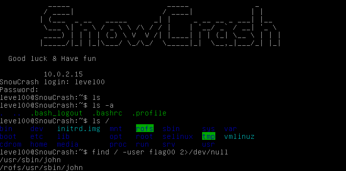

# Snow Crash

**Snow Crash** is a cybersecurity project from **42** focused on discovering and exploiting vulnerabilities in a series of Linux-based challenges.

The project consists of multiple levels. Each level provides a vulnerable environment, and the goal is to investigate it, identify the vulnerability, and obtain the password for the next level.

Throughout the project, I worked with:

* Linux users, groups, and file permissions
* Password and credential security
* Binary analysis
* PCAP files, data that is transmitted over a network
* SUID/SGID permissions
* Environment variables
* OS command injection
* HTTP requests
* CGI scripts
* Perl language

The project is provided by **42 as a bootable ISO image** containing the complete challenge environment.

## Repository Structure

Each level has its own directory.

The repository is intended to document my process of **finding vulnerabilities, understanding why they work, and exploiting them**, rather than simply providing the final answers.
