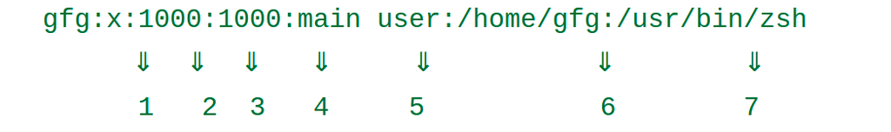

# Security Vulnerability for Level01

## Hashed Password in `/etc/passwd`

The `/etc/passwd` file is one of the most important files in a Linux operating system. It stores essential information about the users on the system.



The structure of the file is:

`gfg` - username

`x` - indicates that the password is stored in the `/etc/shadow` file in an encrypted format. Only authorized users have access to `/etc/shadow`, so the passwords are protected.

The `flag01` user has a password hash stored directly in `/etc/passwd` instead of `x`. This is dangerous because every user on the system can read this file.

## Finding the Password for the `level02` User

### 1. Check Files Belonging to the `flag00` User

Check which files belong to the `flag00` user:

```bash
find / -user flag00 2>/dev/null
```

Result: no files.

### 2. Search for flag01 in the Filesystem

Check the root directory:
```bash
ls /
```

Check the files in each directory:
```bash
cat /dir_name/* | grep "flag01"
```

or 

```bash
find / -type f -exec grep -Hn "flag01" {} \; 2>/dev/null
```

The -H option displays the filename along with the matching line.

Result: a suspicious line containing `flag01` is found in `/etc/passwd`:  
`flag01:hashed_password`  
The other user entries have a structure like this -> `flag00:x:`  

### 3. Identify the Hash Type

Use a hash database to identify the hash type:
[Hash types](https://hashcat.net/wiki/doku.php?id=example_hashes)  

Result: descrypt, DES (Unix), Traditional DES

### 4. Find a Tool to Crack the Hash

Read about the identified hash format:
[Understanding DES Unix](https://www.onlinehashcrack.com/guides/cryptography-algorithms/understanding-des-unix-descrypt-.php#)

Result: the recommended tool is `John the Ripper`.

### 5. Install John the Ripper

Clone the John the Ripper repository:
[John repo](https://github.com/openwall/john/blob/bleeding-jumbo)  

```bash
cd src
./configure && make
cd ../run
```

To execute John the Ripper:   
```bash
./john file_with_password
```

Result: the password for the `flag01` user is recovered.

### 6. Get the Password for the Next Level

Use the getflag command to retrieve the password for the next level.