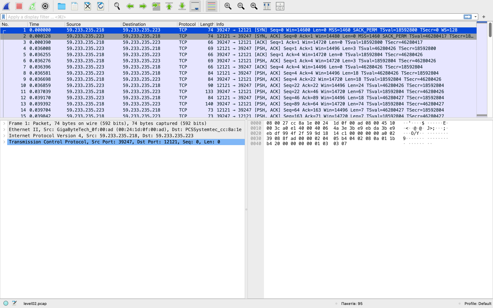
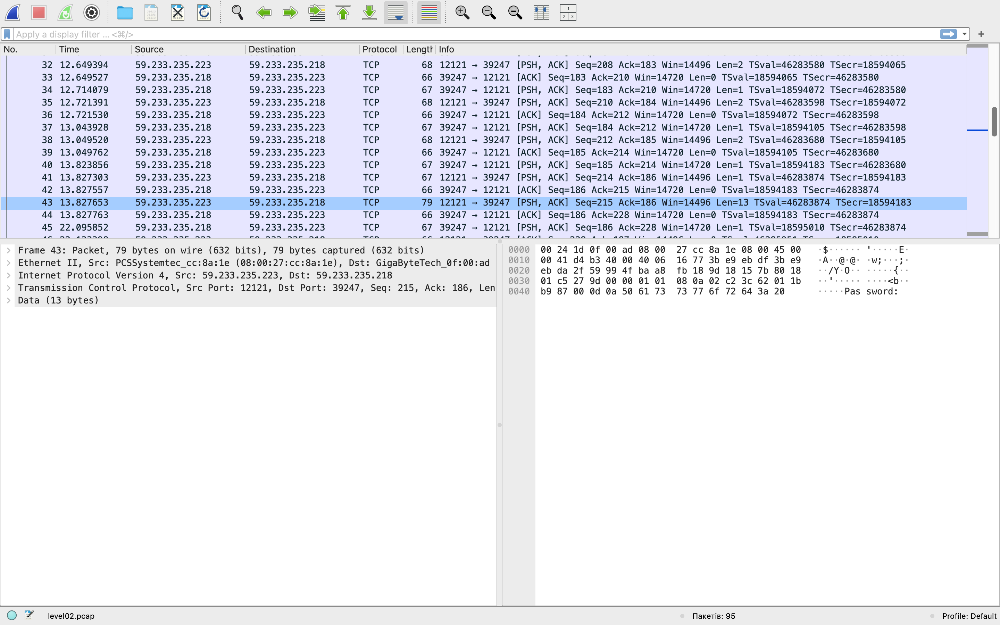

# Security Vulnerability for Level02

The security flaw is that the password is transmitted over the network in plain text, without encryption.

## Finding the Password for the `flag02` User

Level02 provides a file called `level02.pcap`.

`PCAP` stands for Packet Capture.

A PCAP file records data that is transmitted over a network.

PCAP files can be analyzed using tools such as Wireshark, tcpdump, and tshark.

### 1. Read the Binary File

Read the binary file to check for any vulnerabilities.

To simplify the task, use the `strings` command to display only the readable parts of the file:

```bash
strings level02.pcap
```

### 2. Copy the File to the Host Machine

Copy the file from the VM to the host machine so that it can be analyzed with Wireshark.

```bash
scp -P 4242 levelXX@localhost:/home/user/levelXX/file_name directory_on_host
```

### 3. Open the File with Wireshark

Open the PCAP file with Wireshark to inspect all the network packets.


### 4. Find the Packet Containing `Password`



### 5. Follow the TCP Stream

Follow the TCP Stream to see the details of the transmitted packet.

Wireshark allows us to choose the format in which the packet's content is displayed.

In ASCII format, the password appears as:
*Password: letters_and_dots*

Try using this password to connect to flag02. The connection fails.

### 6. Convert Hexadecimal Values to Decimal
Convert the hexadecimal values to decimal to identify the characters represented by the dots.

The following line:

```c
char peer0_21[] = { /* Packet 61 */ 0x7f };
```
is represented by a dot `.` in the password shown above.
The hexadecimal value 0x7f corresponds to decimal 127, which represents the DEL character in ASCII.

This means that the user deleted some characters from the password.

### 7. Get the Password for the Next Level

Use the getflag command to retrieve the password for the next level.