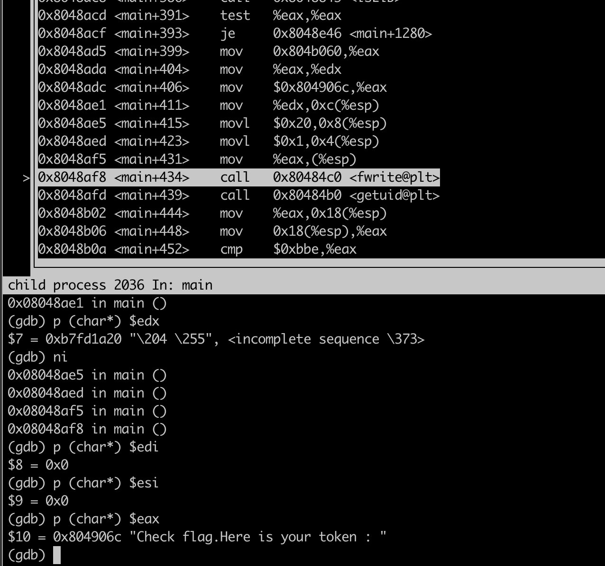
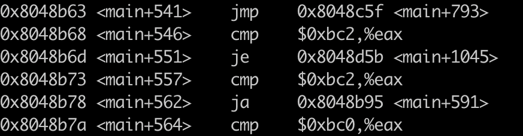
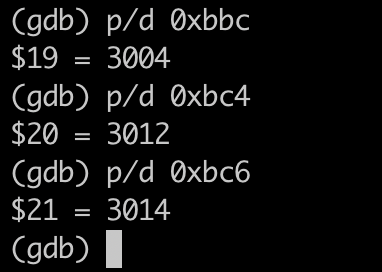
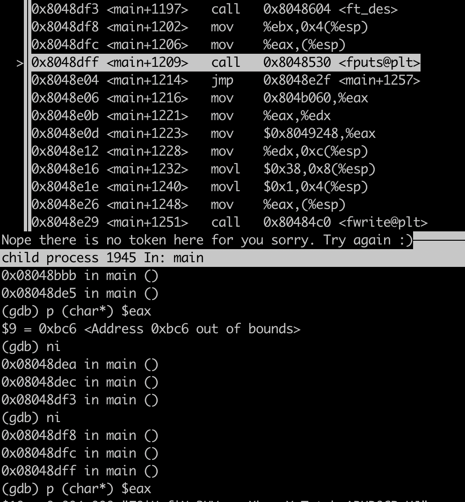

# Security Vulnerability for Level14

Any flag from all the levels is accessible via the binary of `getflag` executable.

## Finding the Last Password

### 1. Inspect `/home/user/level14` Directory

This is empty and any method from the previous levels is not working.

### 2. Inspect `getflag` executable

Find the path to the executable:
```bash
which getflag
/bin/getflag
```

We'll repeat the method from the level13, which is to inspect the assembly code of the executable with GDB:
```bash
gdb -tui /bin/getflag
layout asm
b main
r
```
The program calls `ptrace` function at the beginning to check whether it is being traced by another process, such as GDB. It is a protection that can be easily bypassed. When the process is already being traced, ptrace returns -1, and the program detects this as a debugging attempt and stops execution.

Replace the `ptrace` return value in the `eax` register:
```bash
set $eax=0
```
After this the program continues to run.

We arrive to the line on the screen:


The program prints the phrase that we see everytime after executing `getflag` in the terminal. The important part is after. The program checks the UID: if the user is not allowed to see the token we see:
>Check flag.Here is your token :
Nope there is no token here for you sorry. Try again :)

To check UID the program calls `getuid` and compare the result value with every flag user.

The `eax` register contains the `getuid` return value, which is the real user ID of the process and is compared to the different hexadecimal values, such as 0xbc2 etc.

The decimal value of these hexadecimals will be the user ID.



The program compares the current user user id with a list of authorized users id and if it is the same prints the token - the flag we need to find. It basically means we could see any token of all the previous levels by replacing current `eax` value with the appropriate one.

### 3. Get Flag

To solve level14 we need to replace `eax` value with `3014`:
```bash
id flag14
uid=3014(flag14)
```

After calling `getuid`:
```bash
set $eax=3014
ni
```

We pass this check where `0xbc6` is `3014`:


We reach the `ft_des` function which prints the token. Show `eax` value to see the token:
